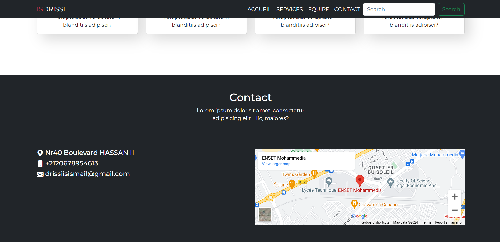
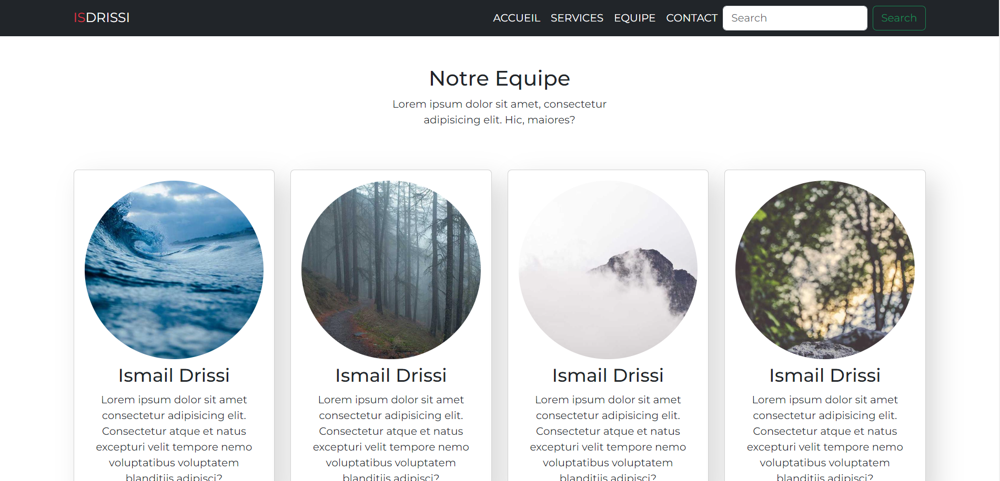
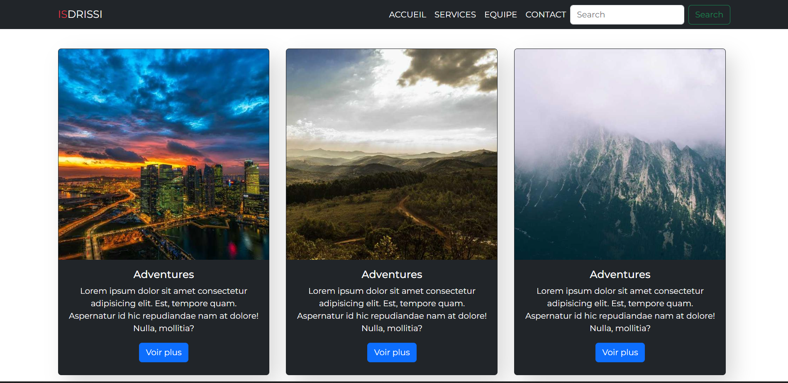
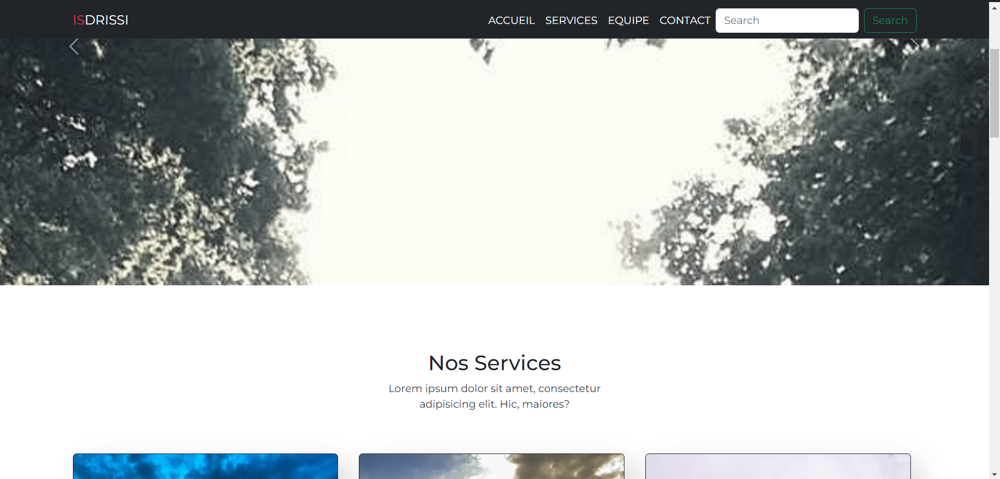
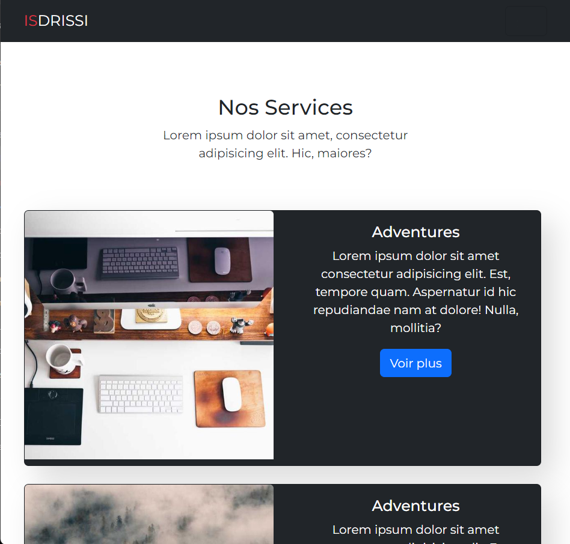

# Bootstrap Website

This repository contains the code for my school project where I created a website using Bootstrap only. The website is designed to showcase my understanding of front-end development using Bootstrap's responsive design features.

## Screenshots

*Carousel section*

*Services section*

*Group section*

*Contact section*

*The page for tablets*

## Features

- Responsive design: The website adjusts its layout and elements based on the screen size, ensuring a consistent user experience across devices.
- Bootstrap components: Utilized various Bootstrap components such as navigation bars, buttons, forms, and cards to enhance the website's aesthetics and functionality.
- Custom styling: Applied custom CSS to personalize the appearance of the website while maintaining Bootstrap's core design principles.
- Interactive elements: Incorporated interactive elements such as sliders, accordions, and modal dialogs to engage users and provide a dynamic browsing experience.
- Accessibility: Ensured that the website is accessible to users with disabilities by following best practices for web accessibility and utilizing Bootstrap's built-in accessibility features.

## How to Run

1. Clone this repository to your local machine.
2. Open the `index.html` file in your web browser.
3. Explore the website and interact with its features.

## Technologies Used

- HTML
- CSS
- Bootstrap

## Contributors

- [Ismail Drissi](https://github.com/ismaildrs)

Feel free to contribute by forking this repository and submitting a pull request with your changes.

If you have any suggestions, feedback, or issues, please open an issue on this repository. Thank you for visiting!

